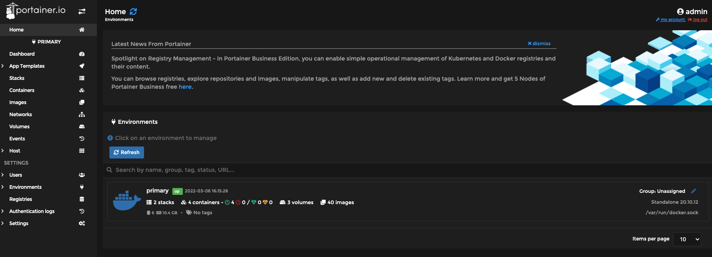
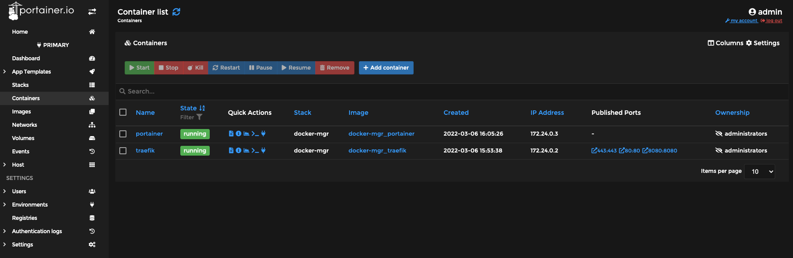
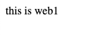
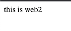
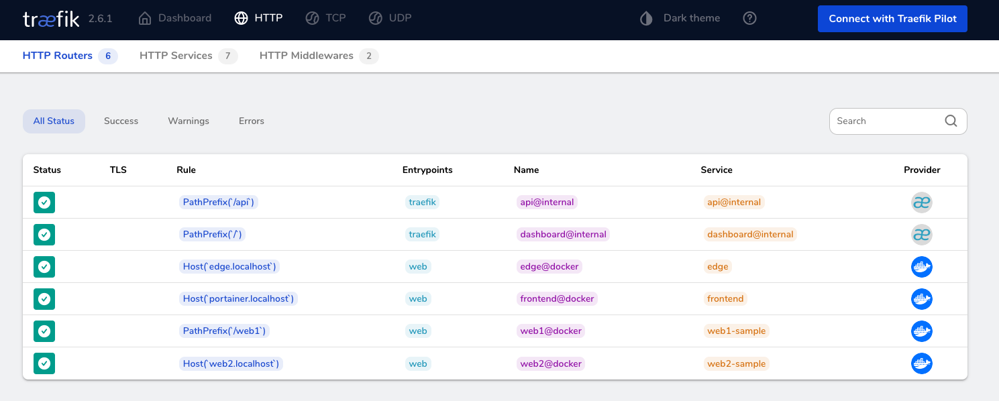
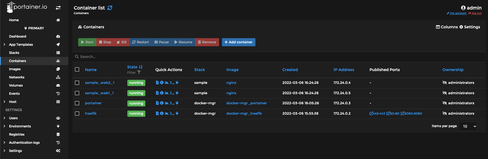

# docker 管理用セット

## 目的

ローカルの docker 開発環境の管理を簡単にするため、traefik と portainer を導入する

## ディレクトリ構成

概説

- traefik と portainer は 1 つ docker-compose.yml で準備する
- 今後作成する docker プロジェクトは、それぞれ別のプロジェクトディレクトリの中で docker-compose.yml を作成し、その際に label で traefik の管理情報を付記する（sample ディレクトリ参照）

構成

- 構成

  ```bash
  # docker-mgr：portainer+traefik
  .
  ├── README.md
  ├── docker-compose.yml
  ├── portainer # portainerの設定等
  │   ├── Dockerfile
  │   └── portainer_data # ローカルマウント用
  └── traefik # traefikの設定等
      ├── Dockerfile
      └── traefik_data
          └── traefik.yml
  ```

  ```bash
  # docker-mgr-pj：traefikによってルーティングされる各種web PJ
  .
  ├── docker-compose.yml
  ├── web1
  │   └── index.html
  └── web2
      └── index.html
  ```

## 手順

1. traefik と portainer を立ち上げる

   プロジェクトルートで下記を実行する

   ```bash
   docker-compose up -d --build
   ```

1. traefik の管理コンソールへのログインを確認する

   `http://localhost:8080`にブラウザでアクセスする

   

1. portainer の管理コンソールへのログインを確認する

   `http://portainer.localhost`にブラウザでアクセスする

   

   > 初回は admin ユーザー作成を求められるので、適当な password を入力する

   Containers から、起動中のコンテナ情報が確認できる

   

1. 新規 PJ を作成し、traefik と portainer への自動反映を確認する

   プロジェクトルートで下記を実行する

   ```bash
   docker-compose -f sample/docker-compose.yml up -d
   ```

   > それぞれのコンテナでの traefik の設定は、`sample/docker-compose.yml`を確認すること

   ブラウザでのアクセス確認
   nginx コンテナが２つ立上がるので、それぞれブラウザに下記を入力してアクセスを確認する

   `http://localhost/web1/`

   

   `http://web2.localhost/index.html`

   

   traefik のルーティングを確認する

   

   portainer の反映を確認する

      
